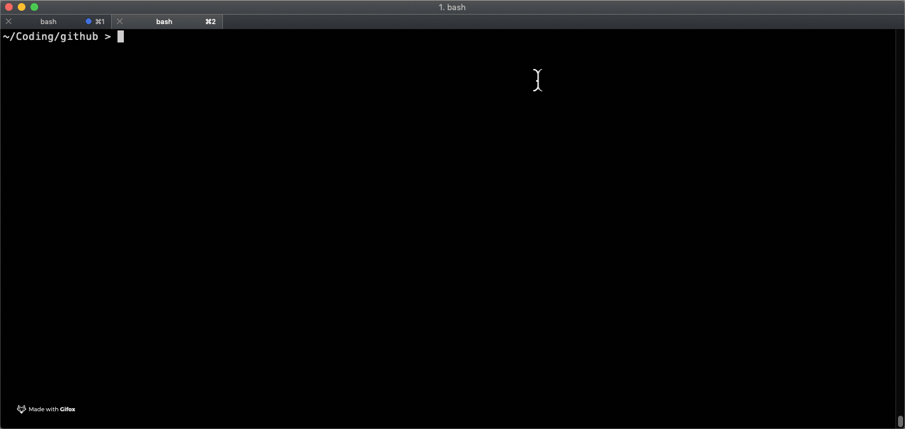

# Sample Python

## Motivation

_to learn a little python..._

> Note you may need to install python3 on your Mac e.g. `brew install python3`
 
## Git Status Folder Utility

A script to drop into all sub-folders and run a `git status` command, giving a summary of whether there are unsaved changes in any of them.

`./status.py` for running `git status` on any subfolders and finding what status they're in (only tested on Mac, assumes python3)

